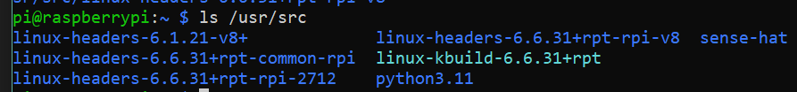
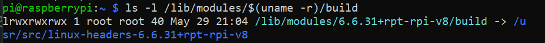
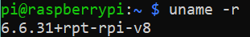

# Header file là gì 

Header file là gì: Trong Linux, header file (tệp tiêu đề) là các tệp có phần mở rộng `.h` chứa các khai báo hàm, macro, biến, và cấu trúc dữ liệu cần thiết để sử dụng các thư viện hoặc chức năng của hệ điều hành. Các tệp này đóng vai trò như "bản đồ" cung cấp thông tin cần thiết để sử dụng các hàm hoặc cấu trúc có sẵn mà không cần viết lại hoặc phải biết chi tiết cách chúng hoạt động bên trong.

=> Là các file `thư viện` code `C/C++`.

Ví dụ về header file được include trong code C:

``` C
#include <stdio.h>
```

# Tại sao Header file và Kernel Version lại cần cùng phiên bản ?

Header file và kernel version cần phù hợp phiên bản (cùng hoặc tương thích) để đảm bảo tính chính xác và ổn định khi biên dịch các module hoặc driver kernel. Điều này là vì các header file của kernel chứa các định nghĩa và khai báo cấu trúc dữ liệu, macro, hàm liên quan đến API của kernel. Các định nghĩa này có thể thay đổi giữa các phiên bản kernel, vì vậy nếu không khớp, các vấn đề có thể xảy ra như lỗi biên dịch, hành vi không ổn định, hoặc driver hoạt động không chính xác.

# Cách kiểm tra Kernel Header version

 Kiểm tra Header file version:

Vì Header file thường sẽ được lưu trong đường dẫn `/usr/src/...` nên ta sẽ dùng lệnh `ls` để liệt kê ra những phiên bản đã được cài đặt trên Kernel:

``` bash
ls /usr/src 
```
Kết quả:

> 


Hoặc: 

``` bash 
ls -l /lib/modules/$(uname -r)/build
```
> Đây là cách kiểm tra chính xác của kernel header.

Kết quả:

> 

Giải thích:

> `/lib/modules/` : Đây là thư mục chứa các module của kernel cho từng phiên bản kernel đã cài đặt trên hệ thống. Mỗi phiên bản kernel sẽ có một thư mục riêng ở đây.
>
>`$(uname -r)` : Cụm này sẽ được thay thế bằng phiên bản kernel hiện tại. `uname -r` là lệnh trả về phiên bản của kernel hiện đang chạy. Dấu `$()` được dùng để thay thế kết quả của lệnh bên trong nó vào câu lệnh chính.
>
>`/build` : Đây là thư mục chứa mã nguồn và kernel headers cần thiết cho việc biên dịch các module hoặc driver cho kernel hiện tại. 
>
>Trong nhiều hệ thống, `/lib/modules/$(uname -r)/build` thực chất là một liên kết tượng trưng (symlink) trỏ đến thư mục thực tế chứa kernel headers 
>(thường là `/usr/src/linux-headers-<kernel-version>` ).

Lưu ý:
> Nếu sau khi gõ lệnh mà terminal báo liên kết hoặc thư mục không tồn tại thì có thể kernel header chưa được cài đặt đúng phiên bản.

# Kiểm tra Kernel Version

Lệnh kiểm tra Kernel Version:

``` bash
uname -r
```

Kết quả: 



Giải thích:

> - `uname` : Lệnh uname trong Linux cung cấp thông tin về hệ điều hành và nhân kernel.
>   - Khi sử dụng lệnh `uname` mà không có tham số, nó sẽ hiển thị tên hệ điều hành (thường là `Linux`).
> - `-r` : Tùy chọn `-r` giúp chỉ định hiển thị phiên bản kernel.

Chi tiết hơn về phiên bản: 

> 1. `6.6.31`: Đây là phiên bản chính, phiên bản phụ và bản vá lỗi của kernel.
>   - `6`: Phiên bản chính của kernel. Đây là bản phát hành chính của Linux Kernel.
>   - `6`: Phiên bản phụ. Những thay đổi ở cấp độ này có thể bao gồm các tính năng mới, tối ưu hóa, và đôi khi là các thay đổi lớn.
>   - `31`: Bản vá lỗi, sửa các lỗi bảo mật hoặc lỗi phát sinh trong các phiên bản trước.
> 2. `+rpt`: Đây là mã định danh cho thấy kernel này đã được tùy chỉnh bởi nhóm Raspberry Pi.
> 3. `-rpi`: Phần này cho biết đây là kernel dành riêng cho Raspberry Pi.
> 4. `-v8` (đề cập đến ARMv8) : Phần này thường cho biết kiến trúc của CPU mà kernel được biên dịch để hỗ trợ .
