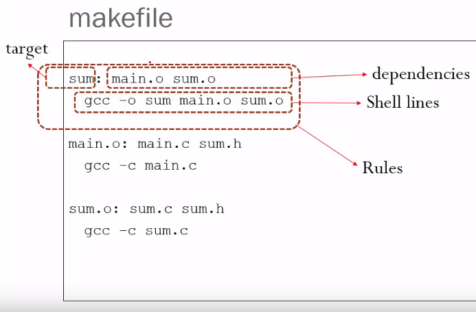
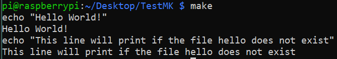

# Make file là gì ? 

`Makefile` là một tệp hướng dẫn cho chương trình `make`, giúp tự động hóa quá trình biên dịch mã nguồn thành chương trình chạy được. Nó liệt kê các quy tắc và mối quan hệ giữa các tệp, để khi bạn thay đổi một phần mã, make chỉ cần biên dịch lại những phần bị ảnh hưởng mà không phải biên dịch toàn bộ dự án, giúp tiết kiệm thời gian.

# Cấu trúc Makefile 

Trước khi sử dụng Makefile hãy cùng tìm hiểu về cấu trúc của nó:

> 

Giải thích: 
> - Target (Mục tiêu): Đây là cái bạn muốn tạo ra, như tệp thực thi hoặc nhiệm vụ cần thực hiện. Ví dụ, nếu bạn đang viết chương trình, target có thể là tệp chạy được như các file `.exe`.
>
> -  Dependencies (Phụ thuộc): Đây là những tệp cần có để tạo ra target (Target phụ thuộc vào những file này). Ví dụ, nếu `sum` cần `main.o` và `sum.o` thì hai tệp đó là dependencies. Nếu bất kỳ tệp nào trong dependencies thay đổi, Makefile sẽ biết để biên dịch lại `sum`.
>
> - Shell lines: Là các dòng chứa lệnh mà hệ thống sẽ chạy trong môi trường dòng lệnh (shell) của `Linux` hoặc `Unix`.
>
> - Rules (Quy tắc): Đây là các lệnh chỉ dẫn cách tạo ra target từ dependencies. Thường là các lệnh biên dịch để chuyển đổi từ mã nguồn thành tệp thực thi.

## Trình tự thực thi của make

Nói ngắn gọn `make` sẽ thực hiện kiểm tra và cập nhật theo thứ tự: **target chính** → **dependencies** → **thực thi rules** → **cập nhật target**

> 1. Xác định `target` chính: Đây thường là target **đầu tiên** trong Makefile, hoặc bạn có thể chỉ định một target cụ thể khi chạy lệnh `make target_name`.
>
> 2. Xác định các `dependencies` của `target`: make sẽ kiểm tra xem các tệp phụ thuộc (dependencies) có được cập nhật hay chưa. Nếu một `dependency` đã thay đổi (mới hơn target), make sẽ chạy `rules` cho `target` đó.
>
> 3. Thực thi các `rules`: make sẽ chạy các lệnh chỉ định trong rules để tạo ra hoặc cập nhật target.
>
> 4. Lặp lại cho các `dependencies` liên quan: Nếu `dependencies` cũng có các target phụ thuộc khác, `make` sẽ lặp lại quy trình trên cho từng `dependency` trước khi hoàn tất target chính.

### Ví dụ: "Hello World"

Makefile:
```bash
hello:
	echo "Hello, World"
	echo "This line will print if the file hello does not exist." # Dòng này sẽ được thực thi nếu chưa có file hello được tạo ra
```
> Phân tích:
>
> - `hello`: Đây là Target 
> - `echo "Hello, World"`: Đoạn lệnh shell line 
>> Lệnh `echo` trong Linux dùng để hiển thị một dòng văn bản hoặc một chuỗi ký tự ra màn hình. 



> Giải thích: 
> 
> Đầu tiên make sẽ chọn `hello` làm `target` **chính** → kiểm tra xem tệp `hello` có tồn tại trong thư mục hiện tại hay không → Nếu tệp `hello` không tồn tại, make sẽ thực thi các lệnh bên dưới nó. 
>
> *Lưu ý:* Nếu tệp `hello` đã tồn tại, `make` sẽ cho rằng `target` đã được xây dựng và không thực thi các lệnh.